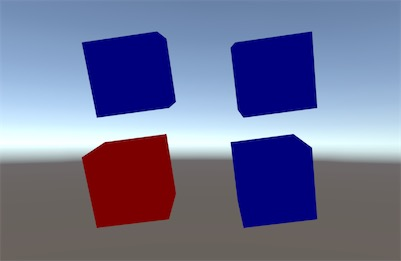
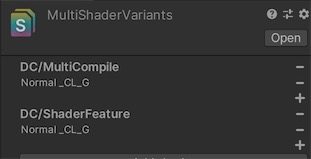
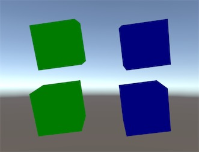

### 测试shader和variants打bundle


#### 测试案例一：


使用ShaderVariantCollection（后续简称为 SVC），记录所有用到的variant。

将SVC和shader打入一个Shader AssetBundle。将材质打成Material AssetBundle.

运行时加载ShaderAB，取SVC，WarmUp，再加载MaterialAB。

对应到 [例子][i6] 中 variants 的场景中， 先选中两个 prefab 和 material， 右键 点击生成 BuildBundle - Mat Sep,在 StreamingAssets 目录下，可以看见生成的 bundle.




<上面两个是直接从 prefab 中加载出来， 下面两个使用的是从 Assetbundle 中加载而来. 左边使用的是shader_feature, 右边使用的是 multi_compile>

SVC 中 只开启了 绿色



从 Bundle 中加载从来的 cube 变成红色（即默认_CL_R）， 说明使用 shader_feature 在没有对应的 Variant打进bundle 的时候会退变使用第一个， 而 multi_compile 则不受影响。 而 当 shader_feature 存在对应的 Varaiant 的时候， 则表现是正常的。




使用如下代码加载对应的 SVC:

```csharp
    void OnGUI()
    {
        if (GUI.Button(new Rect(20, 140, 200, 100), "LoadVariants - Mat"))
        {
            Profiler.BeginSample("LoadVariants");
            LoadVariants();
            LoadMat("mat_shaderfeature");
            LoadMat("mat_multicompile");
            LoadCube("cubemulticompile", new Vector3(2, 0, 0));
            LoadCube("cubefeature", new Vector3(-2, 0, 0));
            Profiler.EndSample();
        }
    }

    private void LoadVariants()
    {
        var pat = Path.Combine(prefix, "shader");
        var b = AssetBundle.LoadFromFile(pat);
        var svc = b.LoadAsset<ShaderVariantCollection>("MultiShaderVariants");
        svc.WarmUp();
        // svc的WarmUp就会触发相关Shader的预编译，触发预编译之后再加载Shader Asset即可
        // b.LoadAllAssets<Shader>();
		b.LoadAllAssets<Material>();
    }

    private void LoadMat(string mat)
    {
        var pat = Path.Combine(prefix, mat);
        var b = AssetBundle.LoadFromFile(pat);
        b.LoadAllAssets<Material>();
    }

    private void LoadCube(string name, Vector3 pos)
    {
        var pat = Path.Combine(prefix, name);
        var b = AssetBundle.LoadFromFile(pat);
        var obj = b.LoadAsset<GameObject>(name);
        var go = GameObject.Instantiate(obj);
        go.name = name + "...";
        go.transform.position = pos;
        b.Unload(false);
    }
```

#### 测试案例二：

SVC、shader和Material打成一个包。

依旧是 [例子][i6] 中 variants 的场景中， 此次只选中两个 prefab， 右键 点击生成 BuildBundle - Mat Join, Material 就会和 shader/SVC 打到一个 Bundle 中。运行时我们不再单独加载 Material：

```csharp
Profiler.BeginSample("LoadVariants");
LoadVariants();
LoadCube("cubemulticompile", new Vector3(2, 0, 0));
LoadCube("cubefeature", new Vector3(-2, 0, 0));
Profiler.EndSample();
```

此次我们看到 无论 shader_feature 对应的 variant 是否对应在 svc中， 则表现都正确。坏处就是所有的资源都关联在一个 bundle 中了。